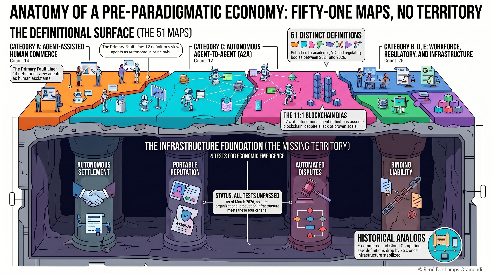

# Claude Code Brief — Paper 04 Full Integration

**Date:** 2026-04-21
**Scope:** Activate Paper 04 ("Fifty-One Maps, No Territory") across all resource pages and verify blog deployment.

---

## Context

Paper 04 has been published on Zenodo and its dedicated paper page (`paper-4-maps.html`), research listing, homepage, blog post, RSS feed, sitemap, and LLM discovery files have already been updated. What remains is activating the "pending" placeholders on the three resource pages (Videos, Podcast, Infographics) and deploying the infographic image to the web root.

---

## Reference Data

| Field | Value |
|---|---|
| Paper title | Fifty-One Maps, No Territory: A Diagnostic Analysis of Definitional Divergence in the Agentic Economy (2021–2026) |
| Short title | Fifty-One Maps, No Territory |
| DOI | `10.5281/zenodo.19679860` |
| DOI URL | `https://doi.org/10.5281/zenodo.19679860` |
| YouTube video ID | `aPp5rWC1aoE` |
| Captivate episode ID | `6426dde8-0402-4d1a-b859-b093543f3dc3` |
| Infographic source | `design-mockups/web/preprint4-final.png` (also at repo root as `Preprint4.png`) |
| Infographic web filename | `preprint4-final.png` (copy to `03-Web/` root alongside existing `preprint2-final.png`, `oracle-infographic-final.png`, etc.) |
| Blog post | `blog/the-agentic-economy-doesnt-exist-yet/index.html` (already created) |
| Blog images | `blog/images/agentic-economy-doesnt-exist-yet-og.png`, `blog/images/definitional-convergence-three-analogs.png`, `blog/images/fifty-one-maps-no-territory-infographic.png` (all already created) |

---

## Task 1: Copy Infographic to Web Root

Copy `design-mockups/web/preprint4-final.png` to `03-Web/preprint4-final.png`.

The other three infographics live at the 03-Web root level:
- `CRI-Anatomy-Agent-Trust-final.png`
- `preprint2-final.png`
- `oracle-infographic-final.png`

Paper 04's infographic must sit alongside them at `03-Web/preprint4-final.png`.

---

## Task 2: Activate Paper 04 on `videos.html`

**File:** `03-Web/videos.html`

Find the Paper 04 card (lines 144–158). It currently has class `pending` and a placeholder message instead of an iframe.

**Replace the entire block:**

```html
      <!-- Paper 04 — pending -->
      <article class="v-card pending">
        <div class="v-frame">
          <div class="msg"><strong>Coming soon</strong>Video summary of the Paper 04 pre-publication will drop alongside the paper's Zenodo DOI.</div>
        </div>
        <div class="body">
          <div class="n">Paper 04 · April 2026 <span class="pill-mini">Pre-pub</span></div>
          <h3>Fifty-One Maps, No Territory</h3>
          <p class="d">Five axes of disagreement across fifty-one competing definitions of "agentic economy" — a mapping exercise that explains why the field can't yet measure itself.</p>
          <div class="row-foot">
            <span class="duration">Upcoming</span>
            <a class="link" href="paper-4-maps.html">Preview paper →</a>
          </div>
        </div>
      </article>
```

**With:**

```html
      <!-- Paper 04 -->
      <article class="v-card">
        <div class="v-frame">
          <iframe src="https://www.youtube.com/embed/aPp5rWC1aoE" title="Fifty-One Maps — video summary" allowfullscreen loading="lazy"></iframe>
        </div>
        <div class="body">
          <div class="n">Paper 04 · April 2026</div>
          <h3>Fifty-One Maps, No Territory</h3>
          <p class="d">Five axes of disagreement across fifty-one competing definitions of "agentic economy" — a mapping exercise that explains why the field can't yet measure itself.</p>
          <div class="row-foot">
            <span class="duration">YouTube · 8 min</span>
            <a class="link" href="paper-4-maps.html">Read paper →</a>
          </div>
        </div>
      </article>
```

**Key changes:**
1. Remove `pending` class from `<article>`
2. Replace placeholder `<div class="msg">` with YouTube iframe (embed ID: `aPp5rWC1aoE`)
3. Remove the `<span class="pill-mini">Pre-pub</span>` from the `.n` div
4. Change duration from "Upcoming" to "YouTube · 8 min"
5. Change link text from "Preview paper →" to "Read paper →"

---

## Task 3: Activate Paper 04 on `podcast.html`

**File:** `03-Web/podcast.html`

Find the Episode 04 block (lines 171–189). It has a pending player div and "Pre-publication" pill.

**Replace the entire block:**

```html
    <!-- Episode 04 — pending -->
    <article class="ep-row">
      <div class="ep-label">
        Episode
        <span class="ep-num">04</span>
        <span class="ep-date">April 2026</span>
      </div>
      <div class="ep-body">
        <h3>Fifty-One Maps, No Territory <span style="font-family:'Outfit',sans-serif;font-size:10px;font-weight:600;letter-spacing:.12em;text-transform:uppercase;padding:3px 9px;border-radius:99px;background:rgba(245,158,11,.12);color:var(--warm);border:1px solid rgba(245,158,11,.3);margin-left:10px;vertical-align:middle">Pre-publication</span></h3>
        <p class="ep-sub">Five axes of disagreement across fifty-one competing definitions of "agentic economy" — why the field can't yet measure itself, and what a minimum-viable shared map would need to include.</p>
        <div class="ep-player pending">
          <div><strong>Coming soon</strong>Audio episode drops with the Paper 04 Zenodo DOI.</div>
        </div>
        <div class="ep-foot">
          <span class="dur">Upcoming</span>
          <a class="link" href="paper-4-maps.html">Preview paper →</a>
        </div>
      </div>
    </article>
```

**With:**

```html
    <!-- Episode 04 -->
    <article class="ep-row">
      <div class="ep-label">
        Episode
        <span class="ep-num">04</span>
        <span class="ep-date">April 2026</span>
      </div>
      <div class="ep-body">
        <h3>Fifty-One Maps, No Territory</h3>
        <p class="ep-sub">Five axes of disagreement across fifty-one competing definitions of "agentic economy" — why the field can't yet measure itself, and what a minimum-viable shared map would need to include.</p>
        <div class="ep-player">
          <iframe src="https://player.captivate.fm/episode/6426dde8-0402-4d1a-b859-b093543f3dc3/" title="Fifty-One Maps — audio paper" frameborder="no" scrolling="no" allow="clipboard-write" seamless loading="lazy"></iframe>
        </div>
        <div class="ep-foot">
          <span class="dur">Podcast · ~20 min</span>
          <a class="link" href="paper-4-maps.html">Read the paper →</a>
        </div>
      </div>
    </article>
```

**Key changes:**
1. Remove `<!-- pending -->` from comment
2. Remove the inline `<span>` with "Pre-publication" pill from `<h3>`
3. Replace `<div class="ep-player pending">` placeholder with active `<div class="ep-player">` containing Captivate iframe (episode ID: `6426dde8-0402-4d1a-b859-b093543f3dc3`)
4. Change duration from "Upcoming" to "Podcast · ~20 min"
5. Change link text from "Preview paper →" to "Read the paper →"

---

## Task 4: Activate Paper 04 on `infographics.html`

**File:** `03-Web/infographics.html`

Find the Paper 04 block (lines 147–163). It has class `pending` and a placeholder div instead of an image.

**Replace the entire block:**

```html
    <!-- Paper 04 — pending -->
    <article class="info-row flip pending">
      <div class="info-visual">
        <div><strong>Coming soon</strong>The Paper 04 infographic — "51 Definitions, 5 Axes of Disagreement" — will be published alongside the paper's Zenodo DOI in April 2026.</div>
      </div>
      <div class="info-text">
        <div class="n">Paper 04 · April 2026</div>
        <h3>Fifty-One Maps, No Territory <span style="font-family:'Outfit',sans-serif;font-size:10px;font-weight:600;letter-spacing:.12em;text-transform:uppercase;padding:3px 9px;border-radius:99px;background:rgba(245,158,11,.12);color:var(--warm);border:1px solid rgba(245,158,11,.3);margin-left:10px;vertical-align:middle">Pre-publication</span></h3>
        <p class="tag">Fifty-one competing definitions of "agentic economy" plotted on five axes of disagreement — scope, autonomy, identity, money, and governance. A mapping exercise that explains why the field can't yet measure itself.</p>
        <div class="stats">
          <span>51 definitions</span>
          <span>5 axes</span>
          <span>Field map</span>
        </div>
        <a class="cta-link" href="paper-4-maps.html">Preview the paper →</a>
      </div>
    </article>
```

**With:**

```html
    <!-- Paper 04 -->
    <article class="info-row flip">
      <div class="info-visual">
        <a href="preprint4-final.png" target="_blank" rel="noopener">
          
        </a>
      </div>
      <div class="info-text">
        <div class="n">Paper 04 · April 2026</div>
        <h3>Fifty-One Maps, No Territory</h3>
        <p class="tag">Fifty-one competing definitions of "agentic economy" plotted on five axes of disagreement — scope, autonomy, identity, money, and governance. A mapping exercise that explains why the field can't yet measure itself.</p>
        <div class="stats">
          <span>51 definitions</span>
          <span>5 axes</span>
          <span>Field map</span>
        </div>
        <a class="cta-link" href="paper-4-maps.html">Read the paper →</a>
      </div>
    </article>
```

**Key changes:**
1. Remove `pending` class from `<article>` (keep `flip` — it alternates layout direction)
2. Replace placeholder `<div>` in `.info-visual` with clickable image link to `preprint4-final.png` (same pattern as Papers 01–03)
3. Remove inline "Pre-publication" `<span>` from `<h3>`
4. Change CTA from "Preview the paper →" to "Read the paper →"

---

## Task 5: Verify Blog Post Deployment

The blog post and its images were already created in a previous session. Verify:

1. **Blog post exists:** `blog/the-agentic-economy-doesnt-exist-yet/index.html`
2. **Blog images exist in `blog/images/`:**
   - `agentic-economy-doesnt-exist-yet-og.png` (OG image, 1200×630)
   - `definitional-convergence-three-analogs.png` (convergence diagram, 1200×700)
   - `fifty-one-maps-no-territory-infographic.png` (full infographic, 2752×1536)
3. **Blog listing (`blog/index.html`)** has Paper 04 card at the top of the list with date April 21, 2026.

If any file is missing, flag it — do NOT recreate from scratch.

---

## Task 6: Verification Checklist

After all edits, run these checks:

1. **No "pending" class remaining for Paper 04** — grep all HTML files for `pending` and confirm none refer to Paper 04.
2. **No "Pre-pub" or "Pre-publication" pills for Paper 04** — grep for these strings.
3. **No "Coming soon" for Paper 04** — grep for "Coming soon" and confirm it doesn't appear in any Paper 04 context.
4. **No "Preview paper" for Paper 04** — all Paper 04 links should say "Read paper →" or "Read the paper →", not "Preview".
5. **No "Upcoming" duration for Paper 04** — should be "YouTube · 8 min" or "Podcast · ~20 min".
6. **YouTube embed ID `aPp5rWC1aoE`** appears in both `paper-4-maps.html` and `videos.html`.
7. **Captivate episode ID `6426dde8-0402-4d1a-b859-b093543f3dc3`** appears in both `paper-4-maps.html` and `podcast.html`.
8. **Infographic image `preprint4-final.png`** exists at the `03-Web/` root level.
9. **DOI `10.5281/zenodo.19679860`** appears on `paper-4-maps.html` (already done, just verify).
10. **Blog post file** exists and is well-formed HTML.

---

## Files Modified by This Brief

| File | Action |
|---|---|
| `03-Web/preprint4-final.png` | Copy from `design-mockups/web/preprint4-final.png` |
| `03-Web/videos.html` | Replace Paper 04 pending block with active YouTube embed |
| `03-Web/podcast.html` | Replace Episode 04 pending block with active Captivate player |
| `03-Web/infographics.html` | Replace Paper 04 pending block with active infographic image |

## Files Already Updated (Do NOT Touch)

These were updated in the previous session and should be left as-is:

- `03-Web/paper-4-maps.html` — fully active with DOI, YouTube, Captivate, BibTeX
- `03-Web/agentic-economy-research.html` — Paper 04 card active with DOI
- `03-Web/index.html` — "Four papers" heading, Paper 04 research card
- `03-Web/blog/the-agentic-economy-doesnt-exist-yet/index.html` — complete blog post
- `03-Web/blog/index.html` — Paper 04 blog card added
- `03-Web/feed.xml` — Paper 04 items added
- `03-Web/sitemap.xml` — Paper 04 URLs added
- `03-Web/llms.txt` and `03-Web/llms-full.txt` — Paper 04 lines added
